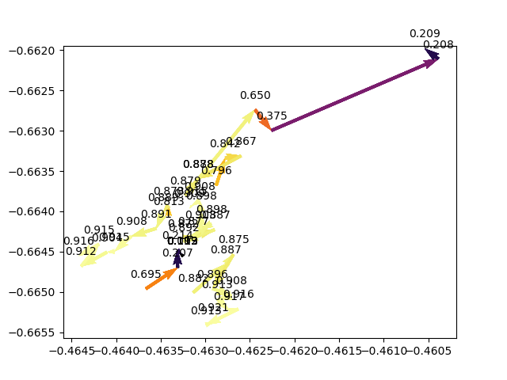
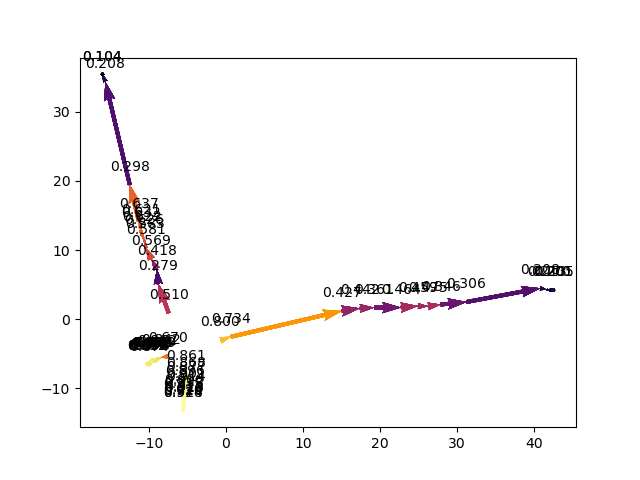
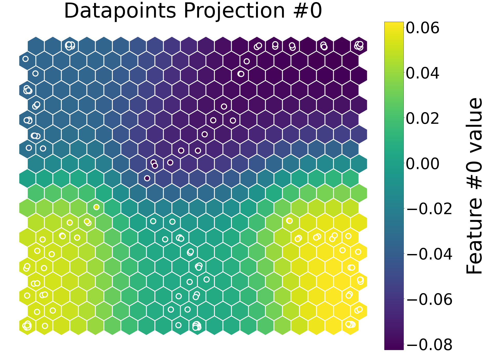
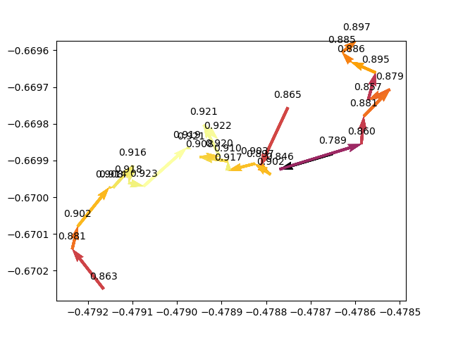
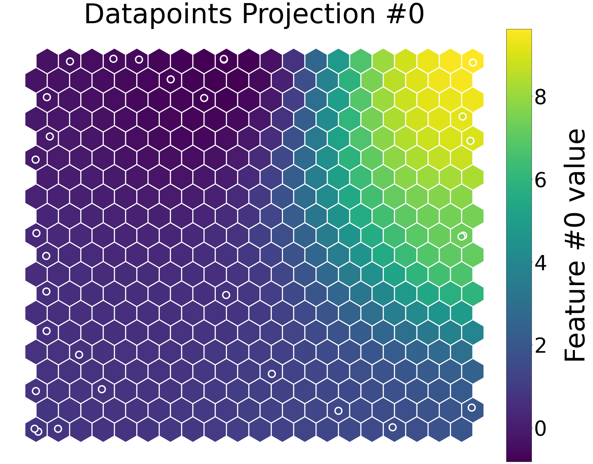
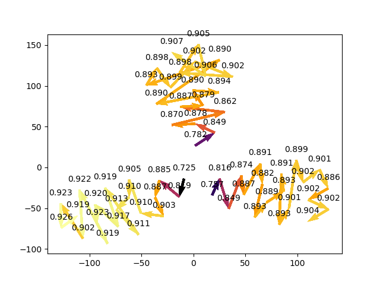

# deep_learning_dynamics
phd experiments: comparing the learning dynamics of deep neural networks trained via back-propagation (from scratch on MNIST vs pre-trained on OMNIGLOT)

## Requirements
```pip install -r requirements.txt```


## Running a New Experiment
inside `src` directory, run:

```python main.py```


## Replicating an Experiment
If you wish to replicate the conditions of a previous experiment, you can check the meta-data for that experiment (TIMESTAMP.json)  - e.g:
```json 
{
   "training_iterations": 10,
   "projection_model": "SelfOrganisingMap",
   "train_projection_model_on_first_only": true,
   "number_of_networks": 3,
   "average_hidden_layers": true
}
```
and manually specify those settings when running the experiment -e.g:

```python main.py --iterations 10 --networks 3 --projection SelfOrganisingMap --train_projection_model_on_first_only --average_hidden_layers```

...when the experiment is complete the results will be saved in `data` directory

## Viewing the Results of an Experiment
inside `src` directory, run:

```python  main.py --timestamp TIMESTAMP```

e.g. to view the plot for experiment 17h32m49s22June2020:

```python  main.py --timestamp 17h32m49s22June2020```

the experiment results should appear momentarily



## Projection Models
In order to trace the learning of the deep neural network through weight space, each network's N-dimensional parameters (weights) are projected down to 2d vectors.  There are several options to achieve this:
- Principal Component Analysis (PCA):  This is a linear dimensionality reduction method (this may not the best choice as the weight space is likely nonlinear in nature)

- Self Organising Map (SOM): This is a non-linear dimensionality reduction method and is quite effective, but takes a long long time to train

- Autoencoder (AE): This is a non-linear dimensionality reduction method and is also quite effective while being much faster to train than an SOM

- Autoencoder with SOM: This maps the N-dimensional weights to an M-dimensional vector (M < N) and then uses a self-organising map to map it to a 2d vector. This speeds up the time taken to train the SOM, however, it is still quite slow. Therefore, we prefer the pure Autoencoder method over this.

- Autoencoder with Tsne: This maps the N-dimensional weights to an M-dimensional vector (M < N) and then uses Tsne to reduce it to a 2d vector.  Tsne is not used on its own as it works best on smaller vectors. However we found Tsne projections to be too stochastic and preferred the pure Autoencoder method over it.
